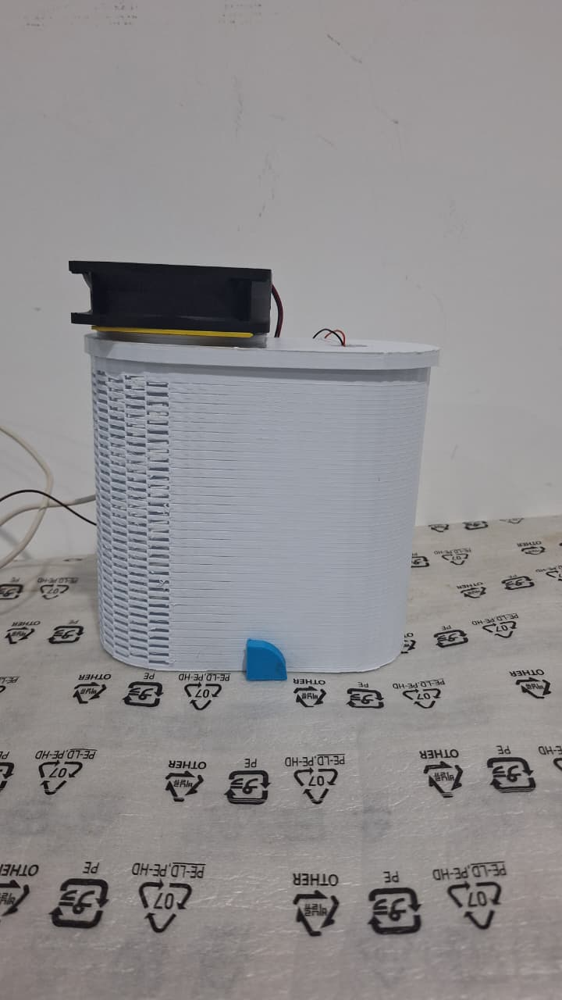

# IoT-Based Indoor Air Quality Monitoring System with Real-Time AI Analysis, Air Purification, and Humidification



## 📌 Overview
DesIoT is a complete, edge-to-cloud IoT solution designed to actively monitor and manage indoor air quality. Rather than just acting as a passive sensor node, this system implements edge automation to control ventilation and humidity, while simultaneously logging time-series data to the cloud for further analysis.

## ⚙️ System Architecture
The architecture is divided into an Edge Controller (ESP32) and a Data Gateway (Raspberry Pi 4):

1. **Sensing:** The ESP32 gathers environmental data via I2C from the **ENS160** (eCO2, TVOC, AQI) and **AHT21** (Temperature, Humidity).
2. **Edge Automation:** The ESP32 evaluates the data against predefined thresholds to automatically trigger a 12V ventilation fan or a 5V humidifier via a 2-channel relay.
3. **Serial JSON Bridge:** To ensure high reliability, the ESP32 packages the raw sensor data into a clean JSON string and transmits it over a wired USB Serial connection to the Raspberry Pi at a 115200 baud rate.
4. **Cloud Gateway:** A Python script on the Raspberry Pi auto-detects the ESP32, parses the incoming JSON, and pushes the time-series data to **ThingSpeak** via HTTP GET requests.

## 🧰 Hardware Components
* **Microcontroller:** ESP32 DevKit V4
* **Gateway:** Raspberry Pi 4 Model B
* **Air Quality Sensor:** ScioSense ENS160 (MOx Sensor)
* **Climate Sensor:** Adafruit AHT21
* **Display:** LCD 16x2 with I2C Backpack
* **Actuators:** 2-Channel Relay Module (Active LOW), 12V DC Fan, 5V Humidifier Module
* **Power:** 12V Battery/Adapter (for Fan), 5V Adapter (for Humidifier and ESP32)

## 🔌 Wiring & Pinout

| Component | ESP32 Pin / Power | Note |
| :--- | :--- | :--- |
| **ENS160 & AHT21** | GPIO 21 (SDA), GPIO 22 (SCL), 3V3, GND | Shared I2C Bus |
| **LCD 16x2** | GPIO 21 (SDA), GPIO 22 (SCL), VIN (5V), GND | Shared I2C Bus (Address `0x27`) |
| **Fan Relay (IN1)** | GPIO 12 | Triggers when TVOC > 150ppb or eCO2 > 1000ppm |
| **Humidifier Relay (IN2)** | GPIO 32 | Triggers when Humidity < 40% |
| **Relay Module Power**| VIN (5V), GND | Requires stable 5V logic power |

> **⚠️ Important Hardware Note:** Do not power the 12V Fan or 5V Humidifier directly from the ESP32 pins. Route the external power supplies (12V battery and 5V adapter) through the Relay's COM and NO (Normally Open) terminals.

---

## 🚀 Step-by-Step Setup Guide

### Step 1: ThingSpeak Cloud Setup
1. Create a free account at [ThingSpeak](https://thingspeak.com/).
2. Click **New Channel** and name it (e.g., "DesIoT Air Quality").
3. Enable 5 Fields and name them exactly as follows:
   * Field 1: `Temperature`
   * Field 2: `Humidity`
   * Field 3: `eCO2`
   * Field 4: `TVOC`
   * Field 5: `AQI`
4. Save the channel and navigate to the **API Keys** tab.
5. Copy your **Write API Key**. You will need this for the Raspberry Pi script.

### Step 2: ESP32 Firmware Flashing
1. Open Arduino IDE or VSCode with PlatformIO.
2. Install the required libraries via the Library Manager:
   * `ScioSense_ENS16x` by ScioSense
   * `Adafruit AHTX0` by Adafruit
   * `LiquidCrystal I2C` by Frank de Brabander
   * `Arduino_JSON` by Arduino
3. Open `main.cpp` (or `.ino`) located in the `/firmware` directory of this repository.
4. Connect the ESP32 to your computer via USB. Ensure the Relay Module's 5V/VIN pin is **unplugged** during the upload process to prevent power draw issues.
5. Select the appropriate ESP32 board and COM port, then click **Upload**.
6. Once the upload is complete, reconnect the Relay Module's power pins.

### Step 3: Raspberry Pi Environment Setup
1. Boot up your Raspberry Pi and open the terminal.
2. Ensure your package lists are up to date and install `pip`:
   ```bash
   sudo apt update
   sudo apt install python3-pip
   ```
3. Install the required Python packages:
   ```bash
   pip3 install pyserial requests
   ```
4. Copy the `pi_gateway.py` script located in the `/gateway` directory of this repository to your Raspberry Pi.
5. Open `pi_gateway.py` and replace `YOUR_API_KEY_HERE` with your actual ThingSpeak Write API Key:
   ```python
   THINGSPEAK_API_KEY = "YOUR_API_KEY_HERE"
   ```

### Step 4: Running the System
1. Plug the ESP32 into the Raspberry Pi via USB. The script will automatically search for the ESP32 port.
2. Run the Python gateway script on the Raspberry Pi:
   ```bash
   python3 pi_gateway.py
   ```
3. The script should state `Connected to [Port]. Waiting for data...` and begin logging the JSON payloads.
4. Check your ThingSpeak dashboard to see the data updating in real-time.

---

## 🛠️ Customizing the Code
If you want to change the thresholds for the actuators, you can edit the following variables at the top of `main.cpp` in the ESP32 firmware:
```cpp
const int TVOC_THRESHOLD_HIGH = 150;       
const int CO2_THRESHOLD_HIGH = 1000;       
const float HUMIDITY_THRESHOLD_LOW = 40.0; 
```